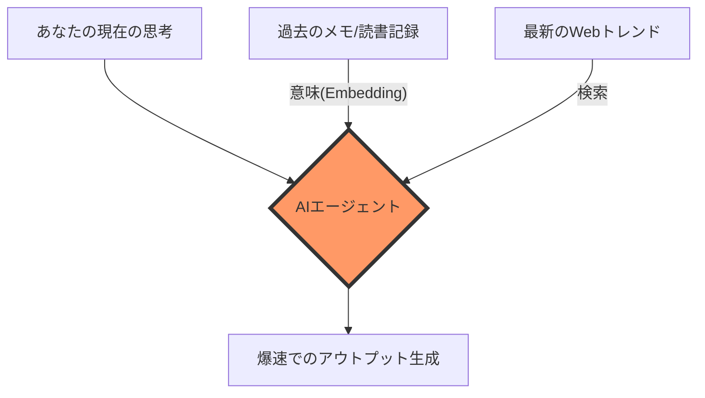

「先週ブックマークした記事が、また今週も読まれずに月曜を迎えちゃった」
「ChatGPTに毎回同じ説明しないと、自分の意図通りに動いてくれないんだよね」
「メモは山ほどあるのに、いざ使うとなると何も繋がらない…」

もし、これがあなたの状況なら、あなたのObsidianは**「死んでる」** かもしれません。

2026年、AIを活用する方法は大きく変わりました。大切なのは「プロンプト（指示文）」を磨くことじゃないんです。**「AIに過去の文脈（Context）をどれだけ深く理解させられるか」**が大事なんだって。

この記事では、Mac StudioとローカルLLMを使って、あなたのObsidianを「勝手に考え、勝手に繋がる知能」へと変身させる方法を紹介します。

## 1. 「プロンプト」はもう過去の話。時代は「コンテキスト（文脈）」へ

昔なら、AIは「賢い検索エンジン」的な存在でした。でもそうすると、毎日同じ指示を出す手間が発生してしまいますよね。

本当の「第2の脳」とは、あなたが何も言わなくても、過去のノートや読書記録、思考の癖を理解し、執筆をバックアップしてくれる存在です。

## 2. 知能化の3つの柱

あなたのObsidianをアップグレードするため、ここでは2026年最新のスタックをお見せします。

### ① ローカルRAG (Smart Connections)
データをクラウドには送らず、Macのローカル（Ollama）で全てのメモをベクトル化します。`nomic-embed-text`モデルを使えば、数万件のノートを0.1秒でスキャンし、「今あなたが書くべきこと」に関連する過去のメモをサイドバーにリストアップしてくれます。

### ② 自律型エージェント (Antigravity/ClawBiz)
ただメモを取るだけでなく、裏側ではAIが競合調査（X解析）を行い、足りないデータを補完し、アイキャッチ画像まで自動で生成する「生産ライン」を作ります。

### ③ 意味的な自動整理 (Auto-Classifier)
タグ付けやフォルダ分けはもう古い。AIが内容を読み取り、勝手にプロパティをつけ、Dataviewで美しいダッシュボードに整頓してくれます。

## 3. 具体的な設定手順

*(以下、Smart ConnectionsやOllamaの設定、Antigravityプロトコルの概要などを解説...)*

# 結論：知識を「貯める」のはやめに、AIと「接続」しよう

情報の墓場を知能の源泉に変える。それが2026年の知識管理（PKM）の正解です。

**執筆協力**: Antigravity (ClawBiz Founding Partner)